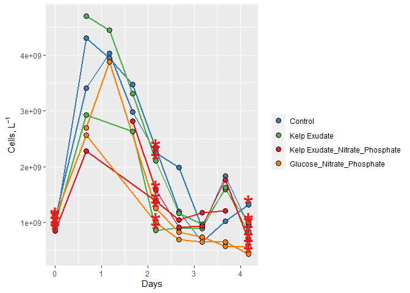
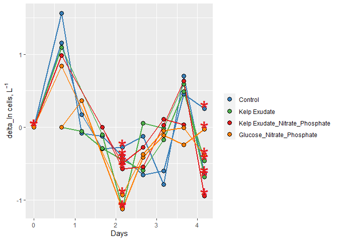
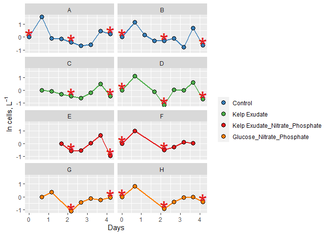

2021 week 4 data
================
Megan Norman
10/18/2021

# 2021 Bacterial Abundance Data Analysis by Megan Norman

## Load Packages

``` r
library(tidyverse)
library(readxl)
library(lubridate)
```

## Import Data

``` r
excel_sheets("Input_Data/week4/144L_2021_BactAbund.xlsx")
```

    ## [1] "Metadata" "Data"

``` r
metadata <- read_excel("Input_Data/week4/144L_2021_BactAbund.xlsx", sheet = "Metadata")
glimpse(metadata)
```

    ## Rows: 80
    ## Columns: 16
    ## $ Experiment           <chr> "144L_2021", "144L_2021", "144L_2021", "144L_2021~
    ## $ Location             <chr> "Goleta Pier", "Goleta Pier", "Goleta Pier", "Gol~
    ## $ Temperature          <dbl> 19, 19, 19, 19, 19, 19, 19, 19, 19, 19, 19, 19, 1~
    ## $ Depth                <dbl> 1, 1, 1, 1, 1, 1, 1, 1, 1, 1, 1, 1, 1, 1, 1, 1, 1~
    ## $ Bottle               <chr> "A", "A", "A", "A", "A", "A", "A", "A", "A", "A",~
    ## $ Timepoint            <dbl> 0, 1, 2, 3, 4, 5, 6, 7, 8, 9, 0, 1, 2, 3, 4, 5, 6~
    ## $ Treatment            <chr> "Control", "Control", "Control", "Control", "Cont~
    ## $ Target_DOC_Amendment <dbl> 0, 0, 0, 0, 0, 0, 0, 0, 0, 0, 0, 0, 0, 0, 0, 0, 0~
    ## $ Inoculum_L           <dbl> 2, 2, 2, 2, 2, 2, 2, 2, 2, 2, 2, 2, 2, 2, 2, 2, 2~
    ## $ Media_L              <dbl> 5, 5, 5, 5, 5, 5, 5, 5, 5, 5, 5, 5, 5, 5, 5, 5, 5~
    ## $ Datetime             <chr> "2021-10-04T16:00", "2021-10-05T08:00", "2021-10-~
    ## $ TOC_Sample           <lgl> TRUE, FALSE, FALSE, FALSE, TRUE, FALSE, FALSE, FA~
    ## $ Cell_Sample          <lgl> TRUE, TRUE, TRUE, TRUE, TRUE, TRUE, TRUE, TRUE, T~
    ## $ DAPI_Sample          <lgl> TRUE, FALSE, FALSE, FALSE, TRUE, FALSE, FALSE, FA~
    ## $ DNA_Sample           <lgl> TRUE, FALSE, FALSE, FALSE, TRUE, FALSE, FALSE, FA~
    ## $ Nutrient_Sample      <lgl> TRUE, FALSE, FALSE, FALSE, FALSE, FALSE, FALSE, F~

``` r
#unique(metadata$Bottle)
#unique(metadata$Treatment)

data <- read_excel("Input_Data/week4/144L_2021_BactAbund.xlsx", sheet = "Data")
glimpse(data)
```

    ## Rows: 72
    ## Columns: 5
    ## $ Bottle       <chr> "A", "A", "A", "A", "A", "A", "A", "A", "A", "B", "B", "B~
    ## $ Timepoint    <dbl> 0, 1, 2, 3, 4, 5, 6, 7, 8, 0, 1, 2, 3, 4, 5, 6, 7, 8, 0, ~
    ## $ all_cells_uL <chr> "901.48904752420799", "4302.9300548457404", "3944.9457004~
    ## $ LNA_cells_uL <chr> "653.047184033284", "768.27893058466896", "937.2441189022~
    ## $ HNA_cells_uL <chr> "248.441863490923", "3534.65112426107", "3007.70158156820~

``` r
#attach data to metadata

joined <- left_join(metadata, data)
```

    ## Joining, by = c("Bottle", "Timepoint")

``` r
glimpse(joined)
```

    ## Rows: 80
    ## Columns: 19
    ## $ Experiment           <chr> "144L_2021", "144L_2021", "144L_2021", "144L_2021~
    ## $ Location             <chr> "Goleta Pier", "Goleta Pier", "Goleta Pier", "Gol~
    ## $ Temperature          <dbl> 19, 19, 19, 19, 19, 19, 19, 19, 19, 19, 19, 19, 1~
    ## $ Depth                <dbl> 1, 1, 1, 1, 1, 1, 1, 1, 1, 1, 1, 1, 1, 1, 1, 1, 1~
    ## $ Bottle               <chr> "A", "A", "A", "A", "A", "A", "A", "A", "A", "A",~
    ## $ Timepoint            <dbl> 0, 1, 2, 3, 4, 5, 6, 7, 8, 9, 0, 1, 2, 3, 4, 5, 6~
    ## $ Treatment            <chr> "Control", "Control", "Control", "Control", "Cont~
    ## $ Target_DOC_Amendment <dbl> 0, 0, 0, 0, 0, 0, 0, 0, 0, 0, 0, 0, 0, 0, 0, 0, 0~
    ## $ Inoculum_L           <dbl> 2, 2, 2, 2, 2, 2, 2, 2, 2, 2, 2, 2, 2, 2, 2, 2, 2~
    ## $ Media_L              <dbl> 5, 5, 5, 5, 5, 5, 5, 5, 5, 5, 5, 5, 5, 5, 5, 5, 5~
    ## $ Datetime             <chr> "2021-10-04T16:00", "2021-10-05T08:00", "2021-10-~
    ## $ TOC_Sample           <lgl> TRUE, FALSE, FALSE, FALSE, TRUE, FALSE, FALSE, FA~
    ## $ Cell_Sample          <lgl> TRUE, TRUE, TRUE, TRUE, TRUE, TRUE, TRUE, TRUE, T~
    ## $ DAPI_Sample          <lgl> TRUE, FALSE, FALSE, FALSE, TRUE, FALSE, FALSE, FA~
    ## $ DNA_Sample           <lgl> TRUE, FALSE, FALSE, FALSE, TRUE, FALSE, FALSE, FA~
    ## $ Nutrient_Sample      <lgl> TRUE, FALSE, FALSE, FALSE, FALSE, FALSE, FALSE, F~
    ## $ all_cells_uL         <chr> "901.48904752420799", "4302.9300548457404", "3944~
    ## $ LNA_cells_uL         <chr> "653.047184033284", "768.27893058466896", "937.24~
    ## $ HNA_cells_uL         <chr> "248.441863490923", "3534.65112426107", "3007.701~

## Prepare Data

We are converting the Date and Time values from characters to dates,
adding columns with the time elapsed for each treatment, and converting
to cells/L. Then subsetting the data for variables of interest and
dropping NA values. To do this we will use the pipe operator “%>%”.

``` r
cells <- joined %>%
  mutate(Datetime = ymd_hm(Datetime),
  all_cells_L = as.numeric(all_cells_uL)*1000000,
  LNA_cells_L = as.numeric(LNA_cells_uL)*1000000,
  HNA_cells_L = as.numeric(HNA_cells_uL)*1000000) %>%
  group_by(Treatment, Bottle) %>%
  mutate(interv = interval(first(Datetime), Datetime),
         s = as.numeric(interv),
         hours = s/3600,
         days = hours/24) %>%
  ungroup() %>%
  select(Experiment:DNA_Sample, all_cells_L, LNA_cells_L, HNA_cells_L, hours, days) %>%
drop_na(all_cells_L)
```

    ## Warning in mask$eval_all_mutate(quo): NAs introduced by coercion

    ## Warning in mask$eval_all_mutate(quo): NAs introduced by coercion

    ## Warning in mask$eval_all_mutate(quo): NAs introduced by coercion

``` r
glimpse(cells)
```

    ## Rows: 60
    ## Columns: 20
    ## $ Experiment           <chr> "144L_2021", "144L_2021", "144L_2021", "144L_2021~
    ## $ Location             <chr> "Goleta Pier", "Goleta Pier", "Goleta Pier", "Gol~
    ## $ Temperature          <dbl> 19, 19, 19, 19, 19, 19, 19, 19, 19, 19, 19, 19, 1~
    ## $ Depth                <dbl> 1, 1, 1, 1, 1, 1, 1, 1, 1, 1, 1, 1, 1, 1, 1, 1, 1~
    ## $ Bottle               <chr> "A", "A", "A", "A", "A", "A", "A", "A", "A", "B",~
    ## $ Timepoint            <dbl> 0, 1, 2, 3, 4, 5, 6, 7, 8, 0, 1, 2, 3, 4, 5, 6, 7~
    ## $ Treatment            <chr> "Control", "Control", "Control", "Control", "Cont~
    ## $ Target_DOC_Amendment <dbl> 0, 0, 0, 0, 0, 0, 0, 0, 0, 0, 0, 0, 0, 0, 0, 0, 0~
    ## $ Inoculum_L           <dbl> 2, 2, 2, 2, 2, 2, 2, 2, 2, 2, 2, 2, 2, 2, 2, 2, 2~
    ## $ Media_L              <dbl> 5, 5, 5, 5, 5, 5, 5, 5, 5, 5, 5, 5, 5, 5, 5, 5, 5~
    ## $ Datetime             <dttm> 2021-10-04 16:00:00, 2021-10-05 08:00:00, 2021-1~
    ## $ TOC_Sample           <lgl> TRUE, FALSE, FALSE, FALSE, TRUE, FALSE, FALSE, FA~
    ## $ Cell_Sample          <lgl> TRUE, TRUE, TRUE, TRUE, TRUE, TRUE, TRUE, TRUE, T~
    ## $ DAPI_Sample          <lgl> TRUE, FALSE, FALSE, FALSE, TRUE, FALSE, FALSE, FA~
    ## $ DNA_Sample           <lgl> TRUE, FALSE, FALSE, FALSE, TRUE, FALSE, FALSE, FA~
    ## $ all_cells_L          <dbl> 901489048, 4302930055, 3944945700, 3467546844, 23~
    ## $ LNA_cells_L          <dbl> 653047184, 768278931, 937244119, 819317989, 65732~
    ## $ HNA_cells_L          <dbl> 248441863, 3534651124, 3007701582, 2648228855, 16~
    ## $ hours                <dbl> 0, 16, 28, 40, 52, 64, 76, 88, 100, 0, 16, 28, 40~
    ## $ days                 <dbl> 0.0000000, 0.6666667, 1.1666667, 1.6666667, 2.166~

## Plot Growth Curves

Plotting a growth curve for each bottle with cell abundance and days
data.

``` r
#assign hex colors to our different treatments.
custom.colors <- c("Control" = "#377EB8", "Kelp Exudate" = "#4DAF4A", "Kelp Exudate_Nitrate_Phosphate" = "#E41A1C", "Glucose_Nitrate_Phosphate" = "#FF7F00")

#assign levels to control order they appear in the legend
levels <- c("Control", "Kelp Exudate", "Kelp Exudate_Nitrate_Phosphate", "Glucose_Nitrate_Phosphate")

#now we will use ggplot to visualize our data.

cells %>%
  mutate(dna = ifelse(DNA_Sample == T, "*", NA)) %>%
  ggplot(aes(x=days, y=all_cells_L, group = interaction(Treatment, Bottle))) +
  geom_line(aes(color = factor(Treatment, levels = levels)), size =1) + 
  geom_point(aes(fill = factor(Treatment, levels = levels)), size = 3, color = "black", shape = 21) +
  geom_text(aes(label = dna), size = 12, color = "#E41A1C") + 
  labs(x = "Days" , y = expression(paste("Cells, L"^-1)), fill = "") +
  guides(color = "none") +
  scale_color_manual(values = custom.colors) +
  scale_fill_manual(values = custom.colors)
```

<!-- -->

``` r
  #facet_grid(rows = "Treatment")
```

## Next Steps

We can calculate: - the total change in cells from initial conditions to
the end of the experiment - specific growth rate as the slope of
ln(abundance) vs time during exponential growth phase - doubling time as
ln(2) divided by the specific growth rate - mean of each of these
parameters across each treatment

First, determine *where* exponential growth is occurring in each bottle,
if it does occur. To do this, plot ln(abundance) vs time.

## Identify exponential growth phase in our remin. experiments.

``` r
ln_cells <- cells %>%
  group_by(Treatment, Bottle) %>%
  mutate(ln_cells = log(all_cells_L),
         diff_ln_cells = ln_cells - lag(ln_cells, default = first(ln_cells)))
```

Now we plot our newly calculated data.

``` r
ln_cells %>%
 mutate(dna = ifelse(DNA_Sample == T, "*", NA)) %>%
  ggplot(aes(x=days, y=diff_ln_cells, group = interaction(Treatment, Bottle))) +
  geom_line(aes(color = factor(Treatment, levels = levels)), size =1) + 
  geom_point(aes(fill = factor(Treatment, levels = levels)), size = 3, color = "black", shape = 21) +
  geom_text(aes(label = dna), size = 12, color = "#E41A1C") + 
  labs(x = "Days" , y = expression(paste("delta_ln cells, L"^-1)), fill = "") +
  guides(color = "none") +
  scale_color_manual(values = custom.colors) +
  scale_fill_manual(values = custom.colors)
```

<!-- -->

Now, plotting ln_cells.

``` r
ln_cells %>%
 mutate(dna = ifelse(DNA_Sample == T, "*", NA)) %>%
  ggplot(aes(x=days, y=diff_ln_cells, group = interaction(Treatment, Bottle))) +
  geom_line(aes(color = factor(Treatment, levels = levels)), size =1) + 
  geom_point(aes(fill = factor(Treatment, levels = levels)), size = 3, color = "black", shape = 21) +
  geom_text(aes(label = dna), size = 12, color = "#E41A1C") + 
  labs(x = "Days" , y = expression(paste("ln cells, L"^-1)), fill = "") +
  guides(color = "none") +
  scale_color_manual(values = custom.colors) +
  scale_fill_manual(values = custom.colors) + 
  facet_wrap("Bottle", ncol =2)
```

<!-- -->
